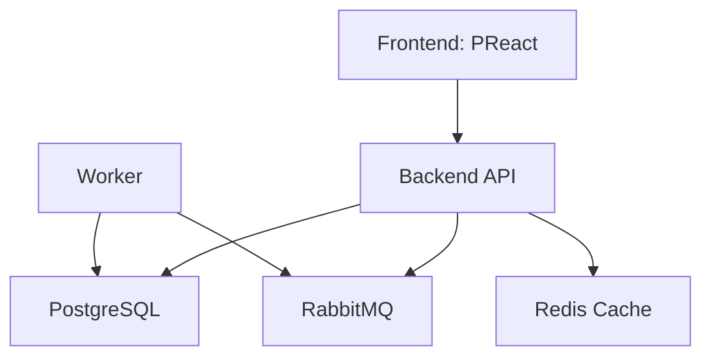

# 📬 Kubernetes Deployment Concept

A production-ready, Kubernetes-powered full-stack application built with:

- 🌐 Frontend: PReact
- ⚙️ Backend: Node.js/Express (API + Worker)
- 🐘 PostgreSQL
- 🐇 RabbitMQ
- 🧠 Redis
- ☸️ Kubernetes (Minikube) for orchestration

---

## 🧰 Tech Stack

| Layer         | Technology            |
| ------------- | --------------------- |
| Frontend      | Preact                |
| Backend API   | Node.js + Express     |
| Worker        | Node.js + RabbitMQ    |
| Database      | PostgreSQL            |
| Queue         | RabbitMQ              |
| Cache         | Redis                 |
| Container     | Docker                |
| Orchestration | Kubernetes (Minikube) |

---

## 🚀 Features

- Submit contact forms via frontend
- Backend API receives and validates data
- Messages are queued via RabbitMQ
- Worker service processes the queue and stores in PostgreSQL
- Redis used for caching (e.g., rate-limiting or temp data)
- Kubernetes orchestrates all services via Minikube

---

## 📦 Docker & Kubernetes

Each service has its own `Dockerfile` and is deployed via Kubernetes manifests:

### 🛠️ Build Docker Images

You can build Docker images and push to a local or remote registry:

```bash
# Use Minikube's Docker daemon
eval $(minikube docker-env)

# Build images
docker build -t preact-frontend ./frontend
docker build -t node-backend ./backend/api
docker build -t node-worker ./backend/worker
```

## 🛠️ Local Development Setup

> 💡 Prerequisites: Docker, Minikube, kubectl

```bash
# Start Minikube
minikube start

# Apply Kubernetes resources
kubectl apply -f k8s/

# To get all deployments
kubectl get deployments

# To get all pods
kubectl get pods

# Access the frontend (example)
minikube service frontend

# Access the backend API
minikube service backend

```



## Working mechanism:

Frontend is access via nginx serving on node port 30002, which will request to backend on node port
30001, node port is used to expose services for the local machine. In production, use Load Balancer
and ingress controller which will route traffic to specific service without exposing each services
publicly. User will use Load Balancer IP/DNS to visit the website in cloud based hosting environment.

---

🧠 Learnings
This project demonstrates:

☸️ Kubernetes service orchestration in Minikube

🧵 Microservice communication via RabbitMQ

📦 Containerization with Docker

🚢 End-to-end deployment using kubectl apply

📬 Message-driven architecture pattern in practice

```

```
